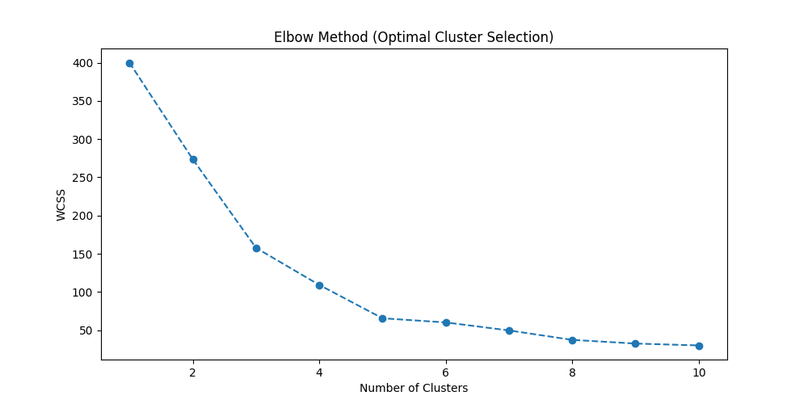
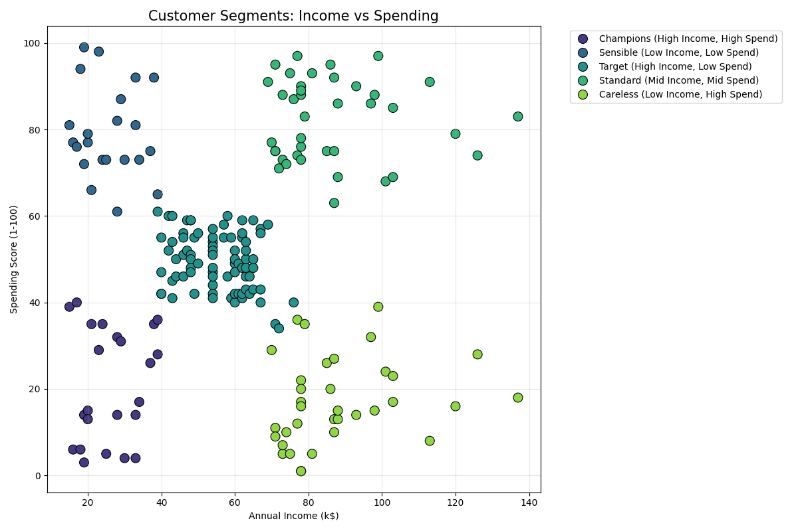

# 🚀 Customer Segmentation & Strategic Business Analysis

This project applies **K-Means Clustering** to a mall customer dataset to identify distinct consumer behaviors and provide actionable business recommendations.

## 🧠 The "Why" Behind the Project
Most segmentation projects stop at technical execution. In this project, I focused on the **business impact**:
* **Optimal K Selection:** While the Elbow Method suggested a range between 3 and 5, I chose **n=5**. Choosing 3 clusters would have merged the "High Income - Low Spend" group into a generic category, causing us to miss a massive growth opportunity.
* **Business Intelligence:** I translated raw cluster numbers into strategic personas (Champions, Target, Careless, etc.) to simulate how a real-world marketing team would use this data.
## 📊 Dataset
The dataset used in this analysis is the **Mall Customer Segmentation Data** from Kaggle. It contains 200 samples with the following features:
* `Customer ID`, `Gender`, `Age`, `Annual Income (k$)`, and `Spending Score (1-100)`.

## 🛠️ Tech Stack & Methodology
* **Python:** `pandas`, `seaborn`, `matplotlib`
* **Scikit-Learn:** `StandardScaler` for normalization and `KMeans` for the core algorithm.
* **Evaluation:** Achieved a **Silhouette Score of 0.55**, indicating well-defined and separated clusters.

## 📁 Project Structure
- `data/`: Raw dataset (`Mall_Customers.csv`).
- `visuals/`: Automatically generated plots for WCSS and Segment Distribution.
- `customer_segmentation.py`: Main script with prediction logic.
- `segmentation_report.csv`: Automated export of cluster statistics.

### 1. The Elbow Method
Used to find the "sweet spot" for the number of clusters.

### 2. Final Segmentation
Visual representation of customers based on Income vs. Spending Score.

## 💡 Strategic Insights (Action Plan)
| Segment | Profile | Recommended Action |
| :--- | :--- | :--- |
| **Champions** | High Income, High Spend | Retain with loyalty programs and VIP access. |
| **Target Group** | High Income, Low Spend | Focus on personalized marketing to trigger spending. |
| **Careless** | Low Income, High Spend | Monitor churn risk; offer flexible payment options. |

## 🚀 How to Run
1. Clone the repo.
2. Install requirements: `pip install -r requirements.txt`
3. Run: `python customer_segmentation.py`

## 🎯 Conclusion
By identifying these 5 distinct segments, businesses can transition from a "one-size-fits-all" marketing approach to **data-driven personalization**, potentially increasing conversion rates and optimizing marketing spend.

---
Developed by Furkan Suncul - https://www.linkedin.com/in/furkan-suncul-bb936724b
